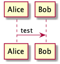

# Istio Course

## UML / Diagram tools  

* [C4 Model](https://c4model.com/)
* [Real World PlantUML](https://real-world-plantuml.com/)
* [C4 PlantUML](https://github.com/RicardoNiepel/C4-PlantUML)
* [PlantUML](https://plantuml.com/)
* [Brew for PlantUML](https://formulae.brew.sh/formula/plantuml)
* 
